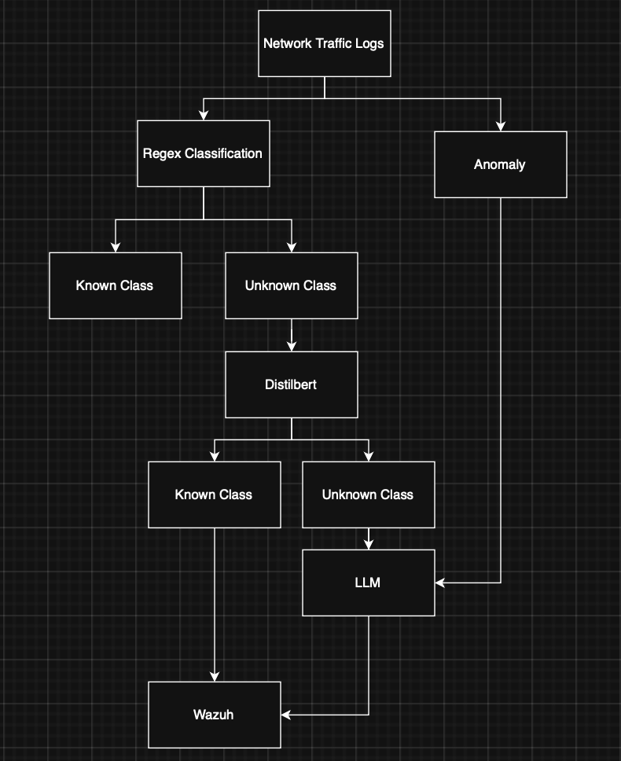

# Morpheus AI Threat Detection System

A complete AI-powered threat detection pipeline using NVIDIA Morpheus, LLM enrichment, and Wazuh SIEM integration for real-time network security monitoring.



## Overview

This system provides:
- **Real-time threat detection** using NVIDIA Morpheus with GPU acceleration
- **Behavioral anomaly detection** using Digital Fingerprinting (DFP) with autoencoder neural networks
- **LLM-powered threat analysis** using Mistral-7B for contextual understanding
- **Smart cooldown logic** to detect multi-log attack patterns (brute force, port scans)
- **Wazuh SIEM integration** for centralized security monitoring
- **Discord alerting** for instant threat notifications

## Architecture
```
Fortinet Firewall
    ↓ (Syslog UDP 5514)
Logstash
    ↓ (Kafka Topic: sys_logs)
NVIDIA Morpheus Pipeline
    ├─ Regex Pattern Matching
    ├─ DistilBERT Classification
    └─ DFP Behavioral Anomaly Detection
    ↓ (Kafka Topic: morpheus-final-realtime-dfp)
LLM Enrichment (Mistral-7B INT4)
    ├─ Smart Cooldown Logic
    ├─ Multi-log Attack Detection
    └─ Contextual Threat Analysis
    ↓ (Kafka Topic: morpheus-llm-enrichment)
Wazuh Indexer (OpenSearch)
    ↓
Wazuh Dashboard + Discord Alerts
```

## Key Features

### 1. Multi-Stage Threat Detection
- **Regex**: Fast pattern matching for known signatures (SQL injection, XSS, command injection)
- **DistilBERT**: ML-based classification for attack categorization
- **DFP (Digital Fingerprinting)**: Behavioral anomaly detection per entity (source IP)
- **LLM**: Contextual analysis for ambiguous threats

### 2. Behavioral Anomaly Detection (DFP)
- Per-entity (srcip) autoencoder models
- Learns normal traffic patterns
- Detects deviations with reconstruction error
- Port scan detection via entropy analysis
- GPU-accelerated training with CuPy

### 3. LLM-Powered Analysis
- Mistral-7B-Instruct-v0.2 with 4-bit quantization
- Smart cooldown: Prevents redundant analysis
- Multi-log detection: Identifies brute force, port scans
- Confidence scoring: 0-100% threat likelihood
- Contextual reasoning: "Why is this a threat?"

### 4. Document ID Deduplication
- Unique document IDs prevent duplicates in Wazuh
- Same log = same ID = update instead of new document
- LLM enrichment adds fields to existing logs

## Prerequisites

- Ubuntu 24.04 LTS
- NVIDIA GPU (for Morpheus + LLM)
- CUDA 12.x
- Docker & Docker Compose
- Wazuh (OpenSearch + Dashboard)

## Quick Start

### 1. Install Dependencies
```bash
# Install Docker
curl -fsSL https://get.docker.com -o get-docker.sh
sudo sh get-docker.sh

# Install Docker Compose
sudo apt install docker-compose

```

### 2. Get your NVIDIA NGC API Key
```bash
Go to: https://ngc.nvidia.com
Sign in with your NVIDIA account.
Click your profile -> Setup -> Generate API Key
Copy the key (you only see it once).
```

### 3. Login Docker to NGC
```bash
docker login nvcr.io
Username: $oauthtoken
Password: <PASTE YOUR API KEY>
```

### 4. Install Logstash

See [Logstash Installation Guide](https://www.elastic.co/docs/reference/logstash/installing-logstash)

### 5. Configure Logstash
```bash
sudo cp configs/logstash/syslog-to-kafka.conf /etc/logstash/conf.d/
sudo systemctl restart logstash
```

See [Logstash Configuration](docs/logstash-setup.md)

### 6. Install Wazuh 

See [Wazuh Installation Guide](https://documentation.wazuh.com/current/installation-guide/index.html)

### 7. Configure Wazuh Integration
```bash
# Copy rules
sudo cp configs/wazuh/local_rules.xml /var/ossec/etc/rules/

# Restart Wazuh
sudo systemctl restart wazuh-manager
```

### 8. Edit llm_enrichment.py
```bash
change OPENSEARCH_PASS to your password
```

### 9. Edit dashboard_writer.py
```bash
change OPENSEARCH_PASS to your password
```

### 10. Edit custom-discord.py
```bash
change OPENSEARCH_PASS to your password
change DISCORD_WEBHOOK to your webhook
```

### 11. Run Setup Script
```bash
chmod +x setup.sh
./setup.sh
```

## Configuration

### Kafka Topics

| Topic | Partitions | Purpose |
|-------|-----------|---------|
| `sys_logs` | 16 | Raw FortiGate logs from Logstash |
| `morpheus-final-realtime-dfp` | 3 | Morpheus pipeline output with DFP scores |
| `morpheus-llm-enrichment` | 1 | LLM-enriched threat analysis |

### Detection Thresholds
```python
# DFP
DFP_ANOMALY_THRESHOLD = 0.70        # 70th percentile
TRAINING_SAMPLES = 5                # Min samples before training
ANOMALY_PERCENTILE = 0.70          # Reconstruction error threshold

# LLM
LLM_CONFIDENCE_THRESHOLD = 0.40     # Analyze low-confidence detections
DFP_SCORE_THRESHOLD = 0.70          # Analyze high DFP scores
COOLDOWN_SECONDS = 600              # 10 minutes same-behavior cooldown
MULTI_LOG_WINDOW = 120              # 2 minutes for multi-log attacks
```

### Wazuh Rules
```xml
<!-- Rule 100200: LLM-confirmed threats -->
<rule id="100200" level="12">
  <field name="llm_status">analyzed</field>
  <field name="llm_is_suspicious">1</field>
  <description>LLM-confirmed threat</description>
</rule>

<!-- Rule 222222: Brute force detection -->
<rule id="222222" level="10" frequency="4" timeframe="120">
  <if_matched_sid>5503</if_matched_sid>
  <same_source_ip />
  <description>Brute Force: 4 attempts in 120s</description>
</rule>
```

## Performance

- **Throughput**: 150-300+ logs/second
- **Latency**: <2 seconds (Firewall → Wazuh)
- **GPU Utilization**: ~60% (Morpheus + LLM)
- **LLM Analysis Rate**: 1-3% of logs (smart filtering)
- **False Positive Rate**: <5% (with LLM validation)

## Testing

### Simulate Port Scan
```bash
nmap -A -T4 192.168.19.80
```
See [Nmap Installation Guide](https://nmap.org/book/install.html)

### Simulate Brute Force
```bash
python examples/test_bruteforce.py
```

### Generate Test Traffic
```bash
python examples/generate_traffic.py
```

## Repository Structure
```
morpheus-threat-detection/
├── README.md
├── docs/
│   ├── architecture.md
│   ├── kafka-setup.md
│   ├── logstash-setup.md
│   ├── morpheus-setup.md
│   ├── llm-enrichment.md
│   ├── wazuh-integration.md
│   └── troubleshooting.md
├── scripts/
│   ├── morpheus/
│   │   └── morpheus_pipeline.py
│   ├── llm/
│   │   └── llm_enrichment.py
│   └── wazuh/
│       ├── llm_to_wazuh.py
│       └── custom-discord
├── configs/
│   ├── logstash/
│   │   └── syslog-to-kafka.conf
│   └── wazuh/
│       ├── local_rules.xml
│       └── ossec.conf
├── deployment/
│   ├── systemd/
│   │   └── morpheus-llm-indexer.service
│   └── docker/
│       └── docker-compose.yml
├── examples/
│   ├── test_bruteforce.py
│   └── generate_traffic.py
├── tests/
│   └── test_smoke.py 
├── requirements-dev.txt
└── requirements.txt
```

## Troubleshooting

### Kafka Connection Issues
```bash
# Check Kafka is running
docker ps | grep kafka

# Test connection
telnet 192.168.19.80 9092
```

### No Logs in Wazuh
```bash
# Check LLM enrichment
sudo journalctl -u morpheus-llm-enricher -f

# Check Wazuh indexer
sudo journalctl -u morpheus-llm-indexer -f
```

See [Troubleshooting Guide](docs/troubleshooting.md)

## License

MIT License - See [LICENSE](LICENSE)

## Authors

- Teetuch Thawinphrai - Initial work

## Acknowledgments

- NVIDIA Morpheus for GPU-accelerated threat detection
- Mistral AI for the LLM model
- Wazuh for SIEM integration

---

**Built with ❤️**
